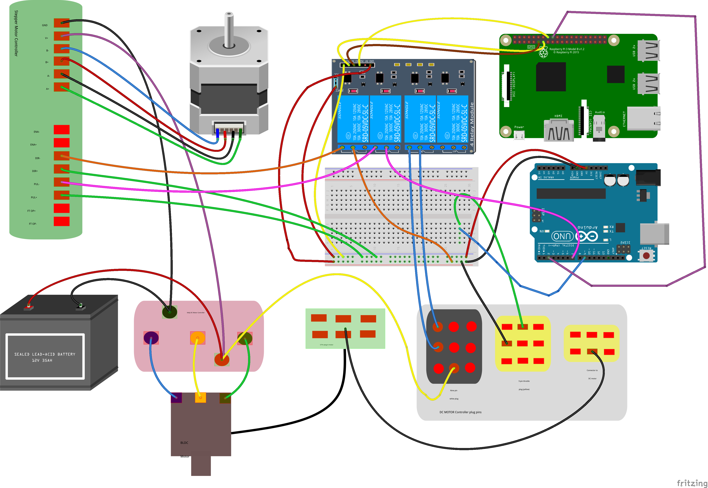
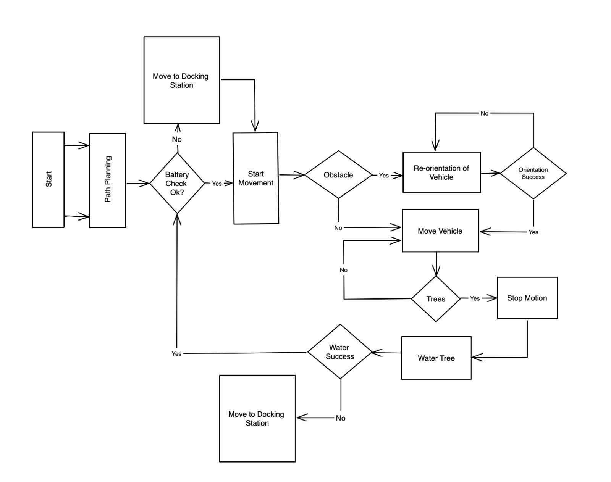

# Vahini: A Self-Driving Auto-irrigation Electric Vehicle

Watering trees is a vital but tedious task for farmers and gardeners. The idea behind project **Vahini** is to use a **self-driving vehicle** to irrigate plantations. The vehicle is equipped with sensors that detect the location of the trees. It then moves along a predefined path and sprays water according to the needs of each plant.

## Working of the Project

The code runs a flask server on a Raspberry Pi device that serves as the brain of the vehicle.
It also interfaces with various sensors such as GPS, proximity sensors and magnetometers to enable accurate navigation and obstacle avoidance.
The project leverages the power of Graph Theory and shortest path algorithms to find the optimal route for the vehicle on any given map. The project utilizes the OSMX library to access high-quality map data and the NetworkX library to perform efficient graph analysis.
The project is currently under development and has great potential for improving agricultural productivity and sustainability.

### Component Diagram

</img>

## Setup Instructions

### Pre-requistes for setup

- Python 3.7 or higher
- An idea on how to use a terminal
- Git Installed on your computer

### Setup

You would have to setup a virtual environment (it is optional but <b>recommeded</b>) and install all the packages using the pip package installer. 
The required packages are listed out in the in `requirements.txt`

For more information and detailed step by step procedure check the [SETUP.md](doc-assets/SETUP.md).

For more information regarding virtual environments visit this here: <a href="https://docs.python.org/3/library/venv.html">venv</a>.

## Architecture

</img>

## Libraries Used

- NetworkX Library
- OSMX Library

## References

- <a href="https://networkx.org">NetworkX</a>
- <a href="https://osmnx.readthedocs.io/en/stable/">OSMNX</a>

## Contributors

- <a href="https://github.com/Blake2912">KC Varun</a>
- <a href="https://github.com/amartyanambiar">Amartya Nambiar</a>
- <a href="https://github.com/healertrix">Abhinav Kumar</a>
